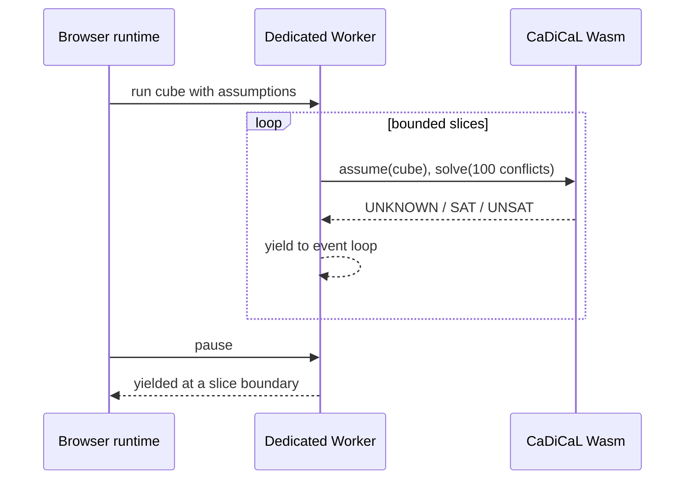

# 1. SAT solving from the beginning

[Guide index](README.md) · [Next: the formula pipeline →](02-formula-pipeline.md)

## What question does SAT answer?

SAT is short for **Boolean satisfiability**. A Boolean variable has only two
possible values: true or false. A SAT solver receives constraints and asks:

> Is there at least one assignment of true/false values that makes every
> constraint true?

Consider three switches:

- `x₁`: the kitchen light is on;
- `x₂`: the hallway light is on;
- `x₃`: someone is home.

The clause `(x₁ ∨ x₂)` says at least one light must be on. The clause
`(¬x₁ ∨ x₃)` says that if the kitchen light is on, someone must be home.
The complete formula is the conjunction:

```text
(x₁ ∨ x₂) ∧ (¬x₁ ∨ x₃)
```

`x₁=false, x₂=true, x₃=false` satisfies both clauses, so the answer is SAT.
A solver may return that assignment as a **model**.

If we add both `(x₁)` and `(¬x₁)`, no assignment can satisfy the formula. The
answer is UNSAT. SAT needs one independently checkable model; UNSAT needs an
argument covering every possible assignment, which is why HiveSAT treats those
two answers differently.

## CNF and DIMACS

HiveSAT accepts conjunctive normal form (CNF): an AND of clauses, where every
clause is an OR of signed variables. DIMACS represents positive variables as
positive integers, negations as negative integers, and ends each clause with
zero.

```text
c the two-clause example above
p cnf 3 2
1 2 0
-1 3 0
```

The header says there are three variables and two clauses. Whitespace is not
semantically meaningful, but the counts and the terminating zeroes are.
HiveSAT's parser rejects missing headers, out-of-range literals, incorrect
counts, trailing data, oversized input, and malformed gzip streams before the
solver sees them.

## What CaDiCaL does

Trying all `2ⁿ` assignments is practical only for tiny `n`. CaDiCaL uses a
family of techniques commonly called CDCL (conflict-driven clause learning):

1. choose a variable and tentatively assign it;
2. propagate consequences forced by clauses;
3. detect a conflict if a clause becomes false;
4. analyze the conflict and learn a clause that prevents repeating it;
5. backtrack to an earlier decision and continue.

HiveSAT compiles CaDiCaL 3.0.1 to single-threaded WebAssembly. One browser
Dedicated Worker owns one solver instance. Parallelism comes from several
workers solving different cubes, not from Wasm threads or shared memory.

## Assumptions create cubes

A **cube** is a conjunction of temporary assignments. If a task carries
assumptions `[3, -8]`, it asks CaDiCaL to solve:

```text
original formula ∧ x₃ ∧ ¬x₈
```

The formula's clauses remain unchanged. Assumptions scope a solver call and are
reapplied on every bounded slice. This lets the browser retain learned clauses
while still keeping the task identity explicit.

## Bounded solving keeps a browser responsive

CaDiCaL calls are synchronous. JavaScript cannot process a pause message in the
middle of a call. HiveSAT therefore gives the solver a small conflict budget,
returns to the worker event loop after each slice, and checks pause state before
the next slice.



`UNKNOWN` here does not mean the formula is fundamentally unknowable. It means
this bounded attempt did not finish. The worker can split the cube or yield it
so another lease can restart it later.

Next: [From a DIMACS file to verified browser memory →](02-formula-pipeline.md)
