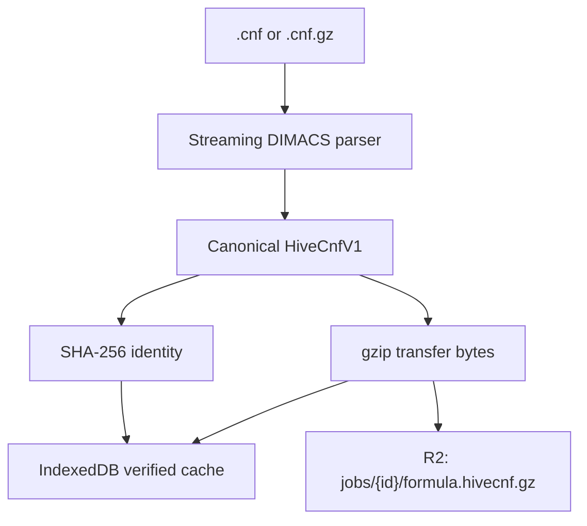

# 2. From a DIMACS file to verified browser memory

[← SAT solving](01-sat-solving.md) · [Guide index](README.md) ·
[Next: distributed cubes →](03-distributed-cubes.md)

HiveSAT deliberately separates formula data from coordination messages.
Formulas can be megabytes; WebSocket messages are capped at 16 KiB. A browser
downloads the formula once, verifies it, caches it by content hash, and then
loads local solver workers from the verified bytes.

## Submission, step by step

1. A formula worker streams plain or gzip DIMACS input.
2. The strict parser checks syntax, counts, and resource limits while reporting
   one-based line/column and zero-based byte offsets.
3. The worker encodes a canonical `HiveCnfV1` byte sequence.
4. SHA-256 is computed over the uncompressed canonical bytes.
5. The bytes are gzip-compressed for transfer and cached in IndexedDB.
6. The browser creates a public job and streams only the gzip object to R2.



The hash is the formula's identity. Filenames, upload timestamps, job IDs, and
gzip implementation details are not part of that identity.

## The canonical binary shape

`HiveCnfV1` starts with the eight ASCII bytes `HIVECNF1`, followed by three
little-endian unsigned 32-bit counts:

```text
offset  size  meaning
0       8     magic/version: HIVECNF1
8       4     variable count
12      4     clause count
16      4     literal-occurrence count
20      ...   signed 32-bit literals; zero terminates each clause
```

The example from page 1 becomes:

```text
header: variables=3, clauses=2, literals=4
body:   1, 2, 0, -1, 3, 0
```

Preserving parsed clause order makes the encoding deterministic. Two valid
DIMACS files with different comments or whitespace produce the same canonical
bytes and therefore the same SHA-256 hash.

## Participant download and cache trust

For a public task, a participant:

1. reads public job metadata and its declared formula hash;
2. checks IndexedDB for that hash;
3. re-decodes and re-hashes every cache hit—IndexedDB is a cache, not a trust
   anchor;
4. otherwise streams bounded gzip bytes from R2;
5. expands them under the encoded-size limit;
6. decodes `HiveCnfV1`, verifies counts and literal ranges, and computes SHA-256;
7. caches only a matching formula;
8. transfers fresh clause-batch buffers to each Dedicated Worker.

The current limits are 5 MiB compressed, 32 MiB canonical bytes, and two
million literal occurrences. A corrupt cache entry is deleted. A network
object whose response header, job metadata, decoded shape, or hash disagrees is
rejected before CaDiCaL is initialized.

## Why workers receive clause batches

Transferring one huge nested JavaScript array would duplicate memory and create
garbage-collection pressure. HiveSAT flattens clauses into `Int32Array` batches,
including zero terminators, and transfers each buffer. Every solver worker gets
its own buffer copy because transferring detaches the sender's buffer.

The formula never travels in the coordinator WebSocket. That socket carries
small cube assumptions, lease IDs, metrics, split literals, and result
manifests.

Next: [How cube-and-conquer distributes one search →](03-distributed-cubes.md)
