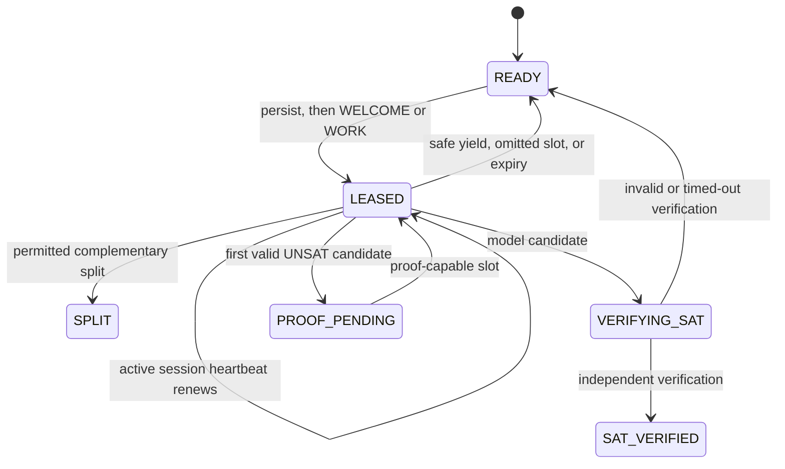

# 3. How cube-and-conquer distributes one search

[← Formula pipeline](02-formula-pipeline.md) · [Guide index](README.md) ·
[Next: result correctness →](04-result-correctness.md)

Cube-and-conquer turns one search space into complementary subspaces. Browsers
can solve those subspaces independently without sharing mutable solver state.


## The one safe split

Suppose a parent task is `C` and CaDiCaL's `lookahead()` selects literal `l`.
HiveSAT permits exactly these children:

```text
left  = C ∧ l
right = C ∧ ¬l
```

They cannot overlap because `l` and `¬l` cannot both be true. Together they
cover every assignment in `C` because every Boolean variable is either true or
false.

The browser sends only `splitLiteral: l` and a coordinator-issued permit ID.
It does **not** send arbitrary child cubes. Inside one SQLite transaction,
`JobCoordinatorDO`:

1. proves the permit, slot, task, and active lease all match;
2. rechecks that connected idle capacity still needs another cube;
3. checks `l` is non-zero, in range, and not already fixed by the parent;
4. checks depth is below 64 and two rows fit below 10,000 total tasks;
5. constructs `[...C, l]` and `[...C, -l]` itself;
6. inserts both `READY` children; and
7. marks the parent `SPLIT` and closes the lease.

No `await` occurs inside this transaction. A crash cannot expose one child
without the other. If capacity changed after the permit was issued, the
coordinator returns `SPLIT_NOT_NEEDED` and the worker keeps solving the parent.

## Stable slots make churn recoverable

Protocol v4 gives each browser worker slot a stable ID. The initial `HELLO`
declares all slots. The coordinator persists initial idle-slot leases before
replying and returns them with resumed work in `WELCOME.activeLeases`. It
persists later leases before pushing `WORK` to the matching slot. There is no
five-second per-slot `REQUEST_WORK` loop.

A lease starts with a five-minute deadline. Once per minute, one session
heartbeat carries the cumulative counters for all slots. A slot whose active
compute advanced receives another rolling five minutes, capped at 60 minutes
from the original issue time and by job expiry.



The browser keeps a mutation under a stable message ID until its ACK arrives.
Only then is that slot displayed and reused as idle. This avoids brief double
ownership and removes the premature-release cause of much of the visible
one/two-worker flicker. A legitimate acknowledged ownership change may still
change the displayed count.

If a tab closes, the lease remains authoritative in SQLite. A reconnect with
the same session and slot IDs resumes it. If the browser does not return, the
single coordinator alarm requeues the exact cube. `leaseCount` is telemetry;
there is no retry ceiling and an intermittent client cannot make a task
`UNKNOWN` by repeatedly disappearing.

## The coordinator controls frontier growth

Splitting every cube eagerly grows an exponential task tree. Polling browsers
for queue pressure also creates latency and request load. Protocol v4 instead
lets the coordinator observe both sides of the decision: durable tasks and
connected slots.

```text
target frontier = min(2 × connected slots, 16)
```

The frontier counts ready tasks, active search leases, and outstanding split
permits. When idle capacity exists below that target, the coordinator grants
only enough short-lived permits to eligible search slots. A slot must first
record at least one second of active computation; this gives unit propagation
and easy CDCL solving a chance to finish before paying for a split. Proof work
never receives a split permit.

No permit means “keep conquering,” not “yield.” With a permit, the worker asks
`lookahead()` once and reports the literal if safe. Depth 64 and 10,000 tasks
remain emergency caps rather than goals. For `N` connected slots, the ordinary
frontier is therefore at most `min(2N, 16)` instead of growing according to a
fixed number of slices in every worker.

## The browser worker pool

Defaults remain conservative:

- desktop: at most two Dedicated Workers;
- mobile: one Dedicated Worker; and
- always bounded by hardware concurrency and the user's preference.

Local solving and public solving are separate experiences. `/` owns only the
local solver. `/swarm` explicitly creates the public runtime and stops it when
the user pauses or leaves. `/jobs` reads status and owner controls without
creating solver workers. A local solve therefore cannot compete with, pause,
or strand a public assignment.

Each public worker:

1. loads independently verified clause batches once;
2. accepts initial/resumed work from `WELCOME.activeLeases` and later pushed
   `WORK` for its stable slot;
3. reapplies cube assumptions before each bounded CaDiCaL call;
4. retains the solver and learned clauses while yielding to the event loop;
5. contributes counters to the one-minute session heartbeat; and
6. reports SAT, a permitted split, safe shutdown/yield, or an UNSAT candidate.

A proof-finisher deliberately reinitializes the worker: it creates a fresh
proof-capable CaDiCaL instance, enables LRAT before loading clauses, and then
solves the exact formula and cube.

## Why overlapping clause partitions are not combined

Solving groups of clauses separately and intersecting their satisfying
assignments is sound only when the groups are variable-disconnected. If two
groups share boundary variables, each can be satisfiable under an incompatible
boundary assignment. Enumerating all compatible boundary assignments restores
correctness but costs up to `2^b` for `b` boundary variables—another SAT search,
not a shortcut.

HiveSAT may measure genuinely disconnected components and boundary width as
preprocessing telemetry or split-variable guidance. It never treats separate
answers for overlapping clause partitions as a model or UNSAT certificate.
Exact complementary cubes and independently checked evidence remain the simple
correct partition.

Next: [Why results are not trusted on arrival →](04-result-correctness.md)
