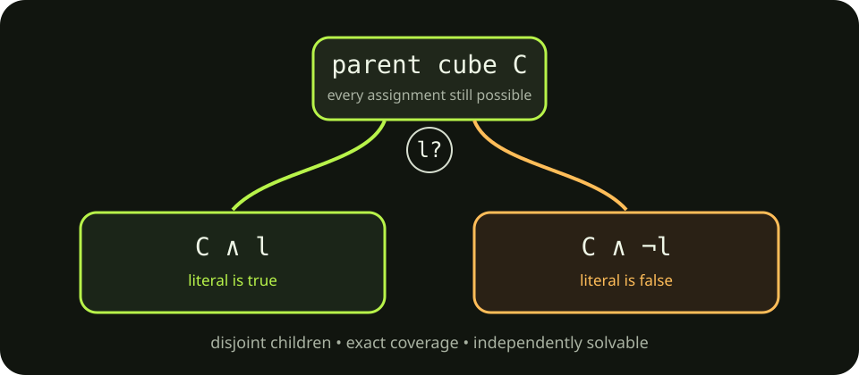
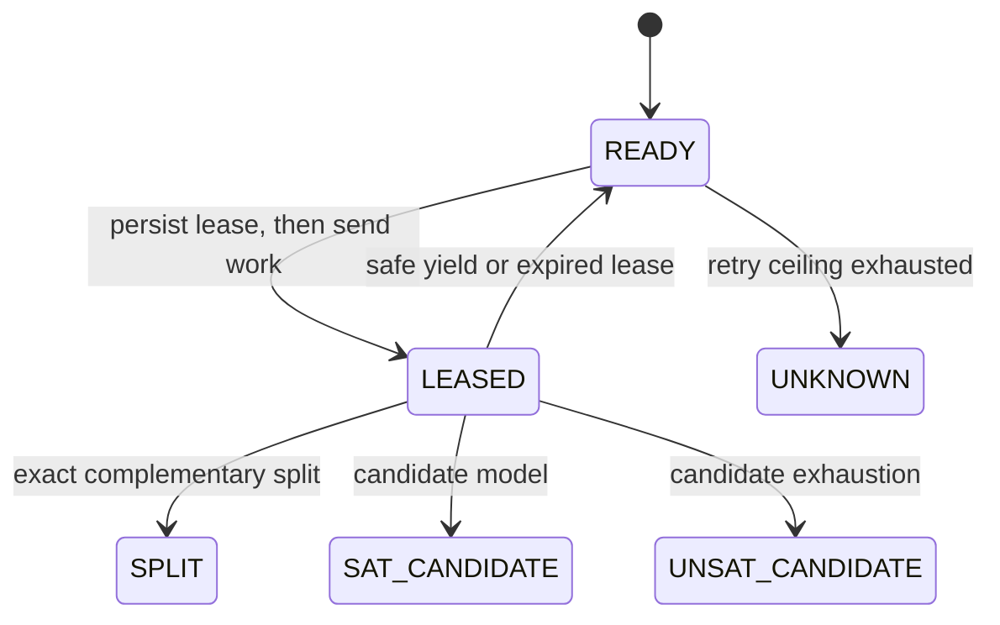

# 3. How cube-and-conquer distributes one search

[← Formula pipeline](02-formula-pipeline.md) · [Guide index](README.md)

Cube-and-conquer turns one search space into complementary subspaces. Browsers
can solve those subspaces independently without sharing mutable solver state.



## The one safe split

Suppose a parent task is `C` and CaDiCaL's `lookahead()` selects literal `l`.
HiveSAT permits exactly these children:

```text
left  = C ∧ l
right = C ∧ ¬l
```

They cannot overlap because `l` and `¬l` cannot both be true. Together they
cover every assignment in `C` because every Boolean variable is either true or
false.

The browser sends only `splitLiteral: l`. It does **not** send arbitrary child
cubes. Inside one SQLite transaction, `JobCoordinatorDO`:

1. proves the lease is active and owns the parent task;
2. checks `l` is non-zero, within the formula's variable range, and not already
   fixed by the parent;
3. checks depth is below 64 and two new rows fit under 10,000 total tasks;
4. constructs `[...C, l]` and `[...C, -l]` itself;
5. inserts both READY children;
6. marks the parent SPLIT and closes the lease.

No `await` occurs inside this transaction. A crash cannot expose one child
without the other or mark the parent split before both exist.

## Leases make churn recoverable

A READY cube becomes LEASED before the coordinator sends it. The lease lasts
15 minutes, with at most one exceptional five-minute extension. Ordinary
progress heartbeats are batched about once per minute and do not rewrite task
progress.



If a tab closes, the lease remains authoritative in SQLite. A reconnecting
session resumes it from the WebSocket attachment. If it never returns, the
single coordinator alarm requeues the cube. CDCL state is not migrated:
another worker loads the same cached formula and restarts the cube assumptions.

## Queue pressure controls splitting

Splitting every cube immediately would grow a huge task tree; never splitting
would leave workers idle. Each WORK message includes a coordinator-computed
queue snapshot based on active sessions:

| Watermark | Meaning |
| --- | --- |
| about `1 × workers` | the ready queue is running low |
| about `3 × workers` | the desired working reserve |
| about `8 × workers` | enough queued work; prefer conquering |

After a bounded solve attempt, a worker asks `lookahead()` for a split only
when the queue is below the target and the coordinator says splitting remains
legal. If there is no safe literal, the worker yields with reason `BUDGET`.

## The browser worker pool

Defaults are intentionally conservative:

- desktop: at most two Dedicated Workers;
- mobile: one Dedicated Worker;
- always bounded by detected hardware concurrency and the user's preference.

Every free worker first checks the user's own active job. Public swarm work is
requested only for capacity left over after owner tasks. This is a local
allocation rule; contributing does not buy server-side priority.

Each worker:

1. receives verified clause batches once;
2. accepts a cube and lease;
3. reapplies cube assumptions before every 100-conflict slice;
4. yields to the event loop between slices;
5. reports sparse aggregate progress;
6. returns SAT, UNSAT-candidate, a safe split literal, or a budget yield.

A SAT model is checked against both the original formula and cube assumptions
in ordinary TypeScript before the browser reports it. A verified candidate lets
that browser stop its other cube workers early. Server-side terminal correctness
is the next layer, covered in Phase 7.

Next: result verification and trust boundaries *(added in Phase 7)*.
