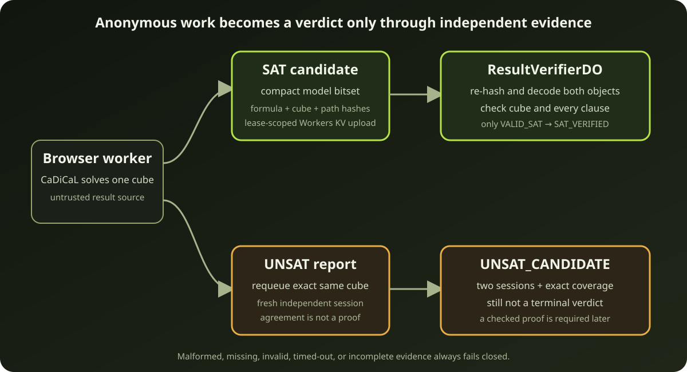
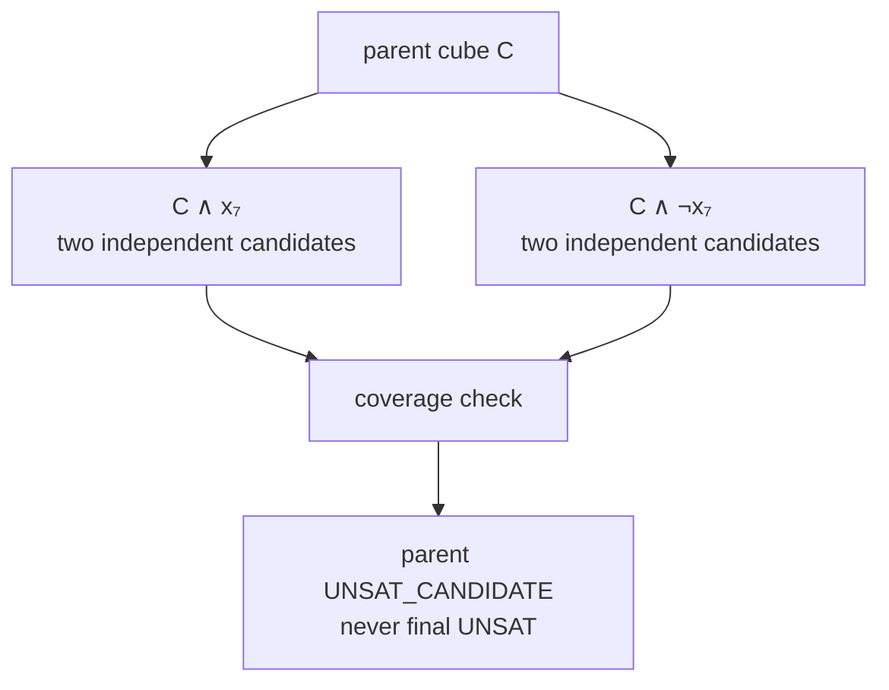

# Why results are not trusted on arrival

A distributed solver asks anonymous browsers to do useful work. That creates a
simple but important rule:

> A browser may propose an answer, but it cannot declare the public answer.

A browser can be buggy, out of date, interrupted halfway through a calculation,
or deliberately dishonest. HiveSAT therefore treats every incoming result as
untrusted data. This page follows a result from CaDiCaL to a public job state
and explains why SAT and UNSAT need different evidence.



## SAT and UNSAT are asymmetric

For a Boolean formula `F`, a SAT answer is an existence claim:

```text
"Here is one assignment x for which F(x) is true."
```

That witness is cheap to check. Walk through every clause and confirm at least
one literal is true. If the formula has two million literal occurrences, the
checker performs at most about two million literal tests.

UNSAT is a universal claim:

```text
"No assignment among all 2ⁿ possibilities makes F true."
```

Two browsers agreeing does not prove that claim. They could share the same
solver bug or both stop too early. Phase 7 uses a second, independent browser
solve only to raise confidence before proof production. A public job still does
not become UNSAT. A later phase must attach and independently check a proof.

| Browser report | Phase 7 meaning | Can it end the public job? |
| --- | --- | --- |
| SAT plus a model | A checkable candidate | Yes, after server verification |
| One UNSAT report | A request for an independent repeat | No |
| Two independent UNSAT reports | A proof-production candidate | No |
| Checked UNSAT proof | A certificate | Not until the proof phase |

## The compact SAT model artifact

Sending a JSON array such as `[1, -2, 3, ...]` wastes bytes. The variable
position already tells us the variable number, so HiveSAT stores only one truth
bit per variable:

```text
byte 0                         byte 8       byte 12
┌─────────────────────────────┬────────────┬──────────────────────┬──────────┐
│ "HSMODL01" magic + version  │ JSON bytes │ bounded JSON metadata│ bitset   │
└─────────────────────────────┴────────────┴──────────────────────┴──────────┘
  8 bytes                       uint32 LE     formula/cube/path      ⌈n/8⌉
```

For one million variables, the assignment is about 125 KiB instead of a
multi-megabyte JSON list. The complete artifact is capped at 512 KiB.

The metadata binds the bits to the exact computation:

- `formulaHash`: SHA-256 of canonical, uncompressed `HiveCnfV1`;
- `taskId` and `cube`: the leased subtree and its assumptions;
- `pathHash`: SHA-256 of the ordered, little-endian cube literals;
- `solverVersion`: the CaDiCaL build that proposed the model;
- `variableCount`: the precise number of truth bits;
- artifact byte length and SHA-256: protection against truncation or swapping.

Suppose a task has cube `[4, -9]`. The model must make variable 4 true and
variable 9 false, in addition to satisfying every formula clause. A valid model
for the formula but not for this cube is rejected.

## Step by step: a SAT candidate

```mermaid
sequenceDiagram
  participant C as "CaDiCaL worker"
  participant B as "Browser runtime"
  participant R as "R2"
  participant J as "JobCoordinatorDO"
  participant V as "ResultVerifierDO"

  C->>B: "SAT + ordered model"
  B->>B: "Check every clause and cube literal"
  B->>B: "Encode bitset; hash artifact"
  B->>R: "Lease-scoped bounded model upload"
  B->>J: "RESULT + manifest"
  J->>J: "Validate lease, formula, task, cube, path"
  J->>V: "Verify immutable formula + model objects"
  V->>R: "Read model and gzip formula"
  V->>V: "Re-hash, decode, check cube and clauses"
  V-->>J: "VALID_SAT"
  J->>J: "Atomically set SAT_VERIFIED"
  J-->>B: "Broadcast terminal result"
```

There are two independent model checks. The browser check catches local solver
or transfer mistakes early. The server verifier is decisive because it does
not trust the browser's memory, parser, claimed hash, or previous check.

The coordinator stores `VERIFYING_SAT` before calling the verifier. This matters
because Durable Objects may release their input gate while awaiting R2 or
another Durable Object. A second message cannot quietly turn an in-flight
candidate into a terminal result.

## Step by step: an UNSAT candidate

The first UNSAT report closes that lease and returns the same exact cube to
`READY`. Another session must solve it from scratch. Results are grouped by
session, so reconnecting and resending the same result does not count twice.

After two distinct sessions report UNSAT, the leaf becomes
`UNSAT_CANDIDATE`. Completion may move up the task tree only when both children
are present and exactly complementary:



The coordinator reconstructs and stores split children itself. During upward
propagation it checks that there are exactly two children, both preserve the
parent prefix, and their last literals are opposites. A missing, duplicated, or
unrelated branch cannot cover the parent search space.

## Failure behavior is part of correctness

Failing closed means uncertainty produces more work or an honest non-answer,
never a convenient verdict.

| Condition | Coordinator behavior | Public meaning |
| --- | --- | --- |
| Invalid formula object, hash, or encoding | Mark job `INVALID`; stop leases | Input cannot be trusted |
| Missing, corrupt, swapped, or false model | Delete model, quarantine session, requeue cube | No verdict |
| Verifier unavailable or budget exhausted | Record timeout, requeue until attempt ceiling | No verdict |
| Task attempt budget exhausted | Mark task `UNKNOWN`; root exhaustion marks job `UNKNOWN` | Explicit non-answer |
| SAT conflicts with UNSAT candidates | Independently verified SAT wins because it has a witness | `SAT_VERIFIED` |
| UNSAT consensus without proof | Keep `UNSAT_CANDIDATE` | Never display final UNSAT |
| Stale but correctly bound SAT artifact | It may be verified; lease age cannot invalidate mathematics | Terminal only if valid |
| Malformed or wrongly bound manifest | Reject before verification | No state promotion |

An invalid model increments session reliability data and quarantines that
session from reconnecting. Timeouts are counted separately because a timeout
does not prove dishonesty. These signals are for abuse containment and bounded
lease sizing only; they never buy or remove scheduling priority.

## The terminal invariant

At the end of Phase 7, the only new terminal path is:

```text
well-formed manifest
  + exact formula/task/cube/path binding
  + present bounded artifacts
  + matching cryptographic hashes
  + valid encodings
  + every cube literal true
  + every formula clause satisfied
  = SAT_VERIFIED
```

Everything else remains a candidate, is requeued, becomes `UNKNOWN`, or marks
the input invalid. That invariant is what lets later swarm scheduling improve
throughput without weakening the meaning of an answer.

Next: fair public-swarm scheduling *(added in Phase 8)*.
