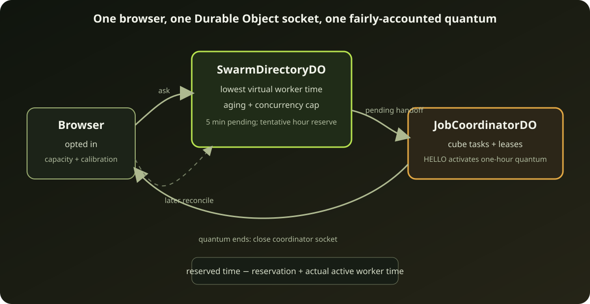

# How the public swarm shares compute fairly

HiveSAT can have many public jobs waiting and many browsers arriving at
unpredictable times. The scheduler must answer one question:

> Which job should receive the next unit of browser worker time?

It does **not** ask who contributed before, who submitted the job, or who can
pay. Every eligible job has equal weight. A person may submit without
contributing and still receives exactly the same scheduling treatment.



## Why counting tasks would be unfair

One cube might finish in 20 milliseconds and another might run for 20 minutes.
Giving two jobs ten cubes each therefore says almost nothing about the compute
they received.

HiveSAT accounts in **worker-milliseconds**:

```text
worker time = active workers × active wall-clock milliseconds
```

If two workers compute for five minutes, the job receives ten worker-minutes.
This works across one fast desktop worker, several slower workers, short tasks,
long tasks, and browsers that disappear.

## Virtual worker runtime

Each active job has a number called `virtual_worker_ms`. Think of it as the
scheduler's ledger of service already received. The next assignment normally
goes to the eligible job with the smallest value.

Assume three jobs begin together:

| Moment | Job A | Job B | Job C | Next |
| --- | ---: | ---: | ---: | --- |
| start | 0 | 0 | 0 | A (oldest tie) |
| A receives 6 worker-min | 6 | 0 | 0 | B |
| B receives 2 worker-min | 6 | 2 | 0 | C |
| C receives 8 worker-min | 6 | 2 | 8 | B |

The scheduler does not try to give every job the same number of assignments.
It keeps cumulative worker time close. Short or interrupted assignments cause
more turns; long assignments cause fewer turns.

## Reserve first, reconcile later

The directory and job coordinator deliberately do not share one long-lived
socket. The handoff is:

```mermaid
sequenceDiagram
  participant B as "Opted-in browser"
  participant D as "SwarmDirectoryDO"
  participant J as "JobCoordinatorDO"

  B->>D: "SWARM_HELLO + capacity + prior actual time"
  D->>D: "Reconcile previous reservation"
  D->>D: "Choose smallest virtual runtime"
  D-->>B: "Five-minute PENDING handoff"
  D--xB: "Close directory socket"
  B->>J: "Open selected job socket; HELLO with stable slots"
  J->>D: "Activate assignment"
  D-->>J: "One-hour ACTIVE quantum"
  J-->>B: "WELCOME with persisted initial/resumed leases"
  J-->>B: "Later WORK pushes for newly idle slots"
  B--xJ: "Quantum ends, pause, or job finishes"
  B->>D: "Reconnect with measured active worker-ms"
```

The directory initially creates a five-minute `PENDING` handoff. It
tentatively reserves the offered capacity and hour-scale worker-time charge so
many simultaneous browsers cannot all observe the same job as unserved. The
browser must reach the selected coordinator and include the assignment ID in
`HELLO` during those five minutes. The coordinator activates it through the
directory, which starts the one-hour `ACTIVE` quantum.

If a pending handoff expires before activation, the directory releases its
worker capacity and fully refunds the tentative virtual-runtime charge. Once
active, the reservation is replaced by measured active worker time when the
browser returns:

```text
new virtual runtime
  = reserved virtual runtime
  - reserved worker time
  + bounded actual worker time
```

If an activated browser never returns to reconcile, the hour reservation
remains charged when it expires. That conservative choice prevents churn from
repeatedly taking free turns. If it returns after doing no work, its job's
recent-service timestamp breaks the tie so another equal job gets the next
assignment.

## New jobs, aging, and concurrency

Starting every new job at zero would let a stream of new arrivals jump ahead
of older jobs. Starting it at the maximum would make it wait too long. HiveSAT
inserts a new job at the **current minimum virtual runtime**.

An aging credit slowly improves a job's effective score while it waits, capped
at one assignment quantum. Aging prevents a job near a concurrency ceiling
from remaining just behind its peers forever; the cap prevents old age from
creating an unlimited priority debt.

No job may hold more than eight assigned workers at once. If a browser offers
more capacity, the excess can go to another job. These three rules work
together:

1. minimum virtual runtime balances service;
2. bounded aging ensures progress;
3. the concurrency ceiling spreads simultaneous capacity.

## Capability changes local slices, never importance

A browser may report local calibration such as conflicts per second. HiveSAT
may use that to choose a conservative per-call conflict slice, but it does not
change scheduling weight or lease ownership:

| Device profile | Conflict slice |
| --- | ---: |
| mobile or below 10k conflicts/s | 50 conflicts |
| ordinary/unknown | 100 conflicts |
| at least 200k conflicts/s | 200 conflicts |

All slots receive the same five-minute rolling lease, renewed by the one-minute
session heartbeat and capped at 60 minutes from issue. Faster devices can do
more work inside that tenure, but they do not receive priority. The fair-job
selection function never receives calibration, contributor history, device
identity, or owner identity. It sees only virtual worker time, wait age, and
current job concurrency.

## What happens when no job is ready?

Jobs enter the directory during admission but become eligible only after their
formula upload completes. This prevents browsers from being assigned to an
`UPLOADING` job.

If no eligible job exists, the directory returns a bounded retry delay and
closes its socket. The browser waits locally, then asks again. The directory is
not kept awake by thousands of idle WebSockets.

Terminal, cancelled, invalid, and expired jobs are removed from scheduling.
Their job coordinator remains the authority for task leases and results; the
directory handles only admission and coarse assignment.

## Deterministic fairness checks

The scheduler simulation deliberately varies:

- task duration from zero-work churn to long-running cubes;
- one-worker and multi-worker devices;
- new jobs arriving after old jobs have accumulated service;
- simultaneous assignments near the eight-worker ceiling;
- browsers returning less actual time than was reserved.

The assertion is based on received worker time, not task count. These tests are
deterministic so a scheduling change that creates starvation produces a
repeatable failure.

Next: [Reading and controlling the Swarm Mode dashboard →](06-swarm-mode.md)
