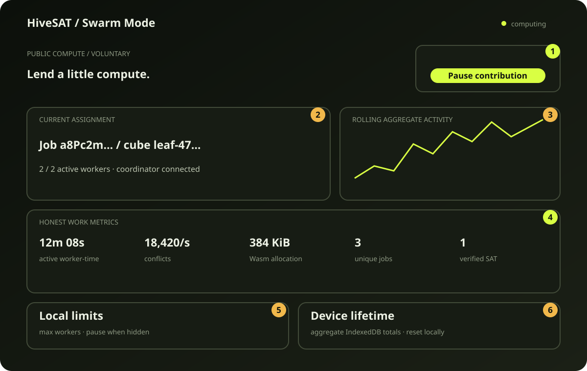
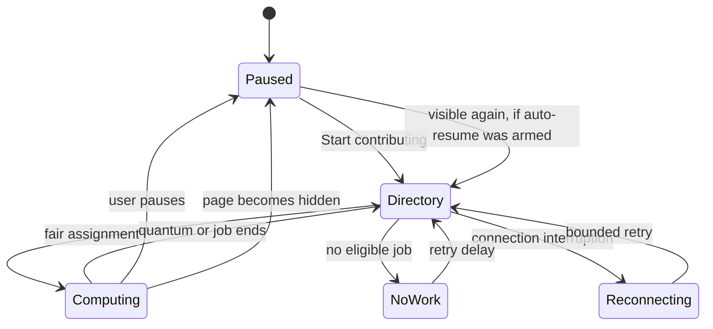

# Reading and controlling the Swarm Mode dashboard

Swarm Mode is the human-facing end of the pipeline described in the previous
pages. It lets a person volunteer browser compute while making the cost,
current state, and measured work visible.

The page deliberately starts **paused**. Opening `/swarm` is not consent to run
public work; pressing **Start contributing** is.

## The contribution lifecycle

Only the `/swarm` component owns `PublicSwarmRuntime`. Leaving the page unmounts
the component and stops the runtime. Public work therefore does not continue
from another HiveSAT route or from a closed tab.

With **Pause when hidden** enabled (the default), a `visibilitychange` event
pauses workers and closes their coordinator connection. If contribution was
running before the tab became hidden, returning to the tab resumes the
directory request. A manual pause clears that intent.

## What each status means

| Displayed state | What is happening |
| --- | --- |
| Paused | No directory or job socket and no public worker task |
| Connecting | The one-shot directory socket is requesting fair work |
| Reconnecting | A bounded retry follows an interrupted directory exchange |
| Computing | The directory socket is closed; one job coordinator socket owns the assignment |
| No work available | No uploaded, non-terminal public job is eligible; retry waits locally |
| Throttled while hidden | The visibility policy stopped public computation |
| Unsupported | A required browser primitive is absent |

The support check requires Web Workers, WebSockets, WebAssembly, and streaming
gzip decompression. An unsupported browser can still read the page but cannot
start contribution.

## Metrics and where they come from

The dashboard avoids broad labels such as “CPU usage” or “memory usage” because
a web page cannot accurately inspect the operating system process.

| Metric | Source | Exact meaning |
| --- | --- | --- |
| Configured capacity | local preference and conservative device detection | maximum Dedicated Workers HiveSAT may create |
| Active workers | cube-runtime slots with a current task | workers currently holding a cube |
| Active compute time | active worker count integrated over elapsed time | worker-weighted wall time, not elapsed page time |
| Conflicts, decisions, propagations | CaDiCaL ABI counters | cumulative solver operations reported by worker messages |
| Conflict throughput | conflicts divided by active worker-seconds | work rate during actual compute |
| Cubes accepted | coordinator `WORK` messages | distinct task leases accepted this session |
| Results returned | SAT/UNSAT result messages | cubes that produced a candidate result |
| Unique jobs helped | local set of assigned public job IDs | jobs touched during this page session |
| Verified SAT contribution | coordinator `JOB_RESULT: SAT_VERIFIED` | this session's candidate became a checked public answer |
| Certified UNSAT contribution | proof-backed terminal message | zero until proof-carrying UNSAT exists |
| Formula bytes transferred | network cache misses only | compressed formula bytes downloaded from R2 |
| Wasm allocation now | `HIVESAT_MEMORY_BYTES` | current Wasm linear-memory allocation across solver workers |
| Wasm high-water | `HIVESAT_MEMORY_HIGH_WATER_BYTES` | highest observed Wasm allocation, not browser-process RAM |
| Global jobs/workers | bounded directory snapshot | aggregate scheduling state, not individual participants |

CaDiCaL counters are cumulative within each worker. The runtime keeps the last
sample per worker and adds only non-negative deltas, preventing repeated
progress messages from double-counting work.

## Session and device-lifetime totals

Live session totals originate in the in-memory external store and are
checkpointed to a `current-session` IndexedDB record so a route change or
reload does not erase them. Device-lifetime totals use a second record in the
same small database, named `hivesat-swarm-stats`.

The database contains aggregate numbers, not formulas, models, task trees, or
contributor identities. **Reset local totals** overwrites those aggregates with
zero and creates a fresh page-session runtime.

Settings use local browser storage:

- maximum worker preference;
- whether hidden pages pause.

Neither setting changes job priority. Maximum workers changes only the local
resource ceiling and the size of a directory reservation.

## The rolling activity graph

Every five seconds, the page appends the directory's aggregate active-worker
count to a bounded 24-point series. Old points fall off. The chart answers “is
the swarm quiet or active?” without exposing a search tree, cube topology, job
formula, session identity, or unbounded history.

This is intentionally the only graph. A live search-tree visualization would
be expensive, easy to misinterpret, and would encourage high-frequency
coordinator messages that conflict with the sparse protocol.

## Mobile and accessibility behavior

Mobile user agents receive a one-worker fallback regardless of reported core
count. Layout columns collapse into a single readable flow, controls remain
native buttons, selects, and checkboxes, and the page does not rely on hover for
meaning.

Status text is announced through an `aria-live` region. Headings and definition
lists preserve reading order, the activity chart has an accessible label and
caption, and every input has a programmatic label.

When the user requests reduced motion, animations and transitions collapse to
effectively zero duration. The state, metrics, and controls remain available;
motion is decorative, never the only status signal.

## A complete example

Imagine a desktop configured for two workers:

1. The user opens `/swarm`; status is **Paused**, workers are `0 / 2`.
2. They press **Start contributing**.
3. The directory assigns job `abc…` for an hour and closes its socket.
4. The job coordinator leases two cubes. The page shows `2 / 2`, their current
   task, and increasing CaDiCaL counters.
5. One cube yields after its budget. `Cubes accepted` stays cumulative while a
   new cube is leased.
6. The user switches tabs. Both cubes yield safely and status becomes
   **Throttled while hidden**.
7. They return. The browser reports actual worker-time to the directory and
   receives the next fair assignment.
8. A SAT model from this browser passes `ResultVerifierDO`. Only then does
   `Verified SAT contributions` increase.

At every step, the user can distinguish configured capacity, active work,
solver operations, network transfer, and Wasm allocation without being shown a
number the browser cannot honestly measure.
