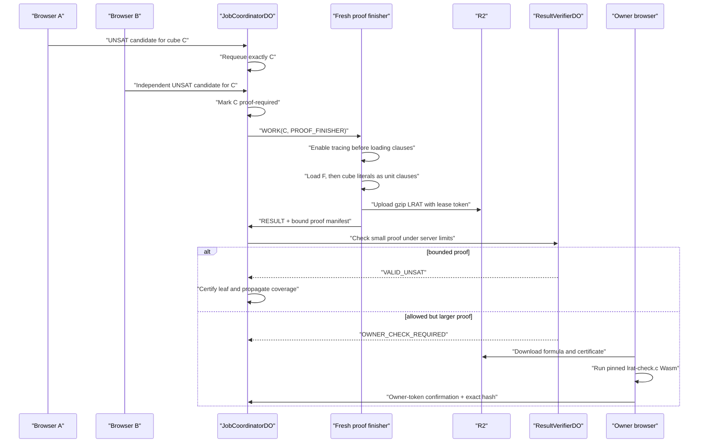
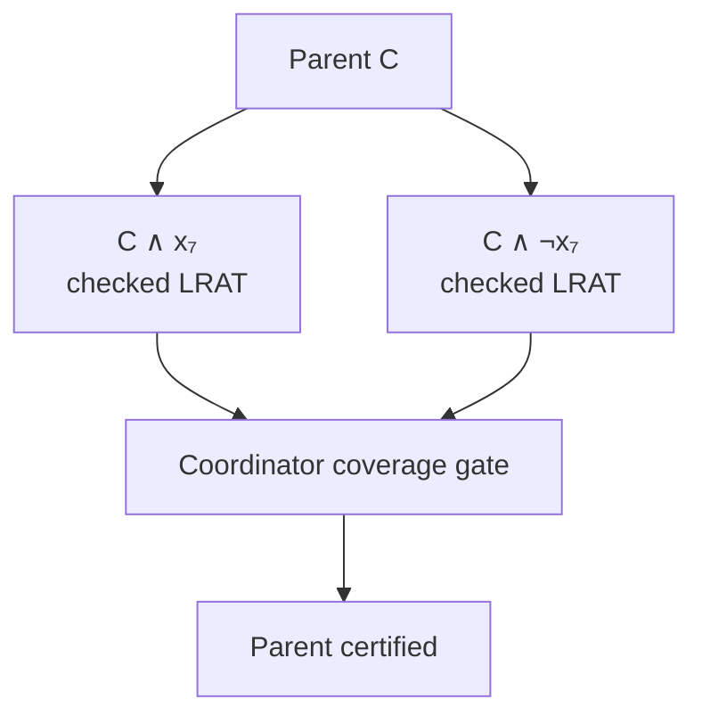

# How proof-carrying UNSAT becomes a certificate

SAT and UNSAT need different evidence. A satisfying assignment is a compact
witness: check every clause and the claim is settled. UNSAT says that *every*
possible assignment fails. Two browsers reaching UNSAT independently is a
useful fault-detection step, but it is not a mathematical certificate.

HiveSAT closes that gap with LRAT proofs. An LRAT proof is a list of clauses
plus explicit references to earlier clauses that justify each addition. An
independent checker follows those references with unit propagation and accepts
only if the proof derives the empty clause.

## The complete pipeline



There are three deliberately separate solver instances:

1. The first browser finds an UNSAT candidate.
2. A different session repeats the cube from scratch.
3. A proof-finisher creates a *new* CaDiCaL instance, enables LRAT tracing
   before loading any clause, and solves `F ∧ cube`.

The proof-finisher is not a continuation of either candidate solver. That
prevents missing trace history and keeps the proof tied to a complete clause
load.

## How the cube becomes part of the proof formula

Suppose canonical `HiveCnfV1` contains 800 clauses and the task cube is
`[4, -9]`. The proof solver loads these clauses in this order:

```text
clause IDs 1..800   canonical formula F
clause ID 801       4 0
clause ID 802      -9 0
```

The manifest records `originalClauseCount: 800` and
`cubeClauseIds: [801, 802]`. It also binds:

- the SHA-256 of uncompressed canonical `HiveCnfV1`;
- ordered cube literals and their ordered-little-endian path hash;
- job task and lease-scoped artifact IDs;
- CaDiCaL and checker identities;
- compressed and decompressed byte lengths; and
- SHA-256 of the exact gzip artifact.

Changing the formula, reordering the cube, swapping an artifact, or claiming
different clause IDs breaks at least one binding before proof checking begins.

## Artifact transport and limits

Proof text does not travel through WebSockets. The browser compresses it with
gzip and streams it to a job-scoped R2 key under the active lease ID. The
control message contains only the bounded manifest.

| Limit | Value | Failure behavior |
| --- | ---: | --- |
| Compressed proof data per job | 32 MiB | reject upload or return `UNKNOWN` |
| Decompressed proof artifact | 128 MiB | reject before checking |
| Server-check compressed proof | 2 MiB | route to owner-browser check |
| Server-check decompressed proof | 8 MiB | route to owner-browser check |
| Cube depth | 64 literals | reject malformed binding |

The job-wide compressed limit is cumulative across proof artifacts, not a
per-upload loophole. R2 stores the gzip object, while the coordinator stores
only its manifest and verification state.

An oversized proof is never truncated. Truncation could remove the empty
clause or references and make the artifact ambiguous. HiveSAT instead fails
closed: a task becomes `UNKNOWN` when it exceeds platform bounds, or the
browser solver may split earlier while ordinary search is still possible.

## Two independent checking paths

The production build pins DRAT-trim's MIT-licensed `lrat-check.c` at commit
`2e3b2dc0ecf938addbd779d42877b6ed69d9a985`. Its source digest lives in
`solver/versions.env`. The reproducible Emscripten build emits
`lrat-check.mjs` and `lrat-check.wasm` beside CaDiCaL, and CI byte-compares both
checker artifacts.

Small proofs use a bounded checker inside `ResultVerifierDO`. It meters proof
bytes, derived clauses, and hint references before declaring
`UNSAT_CERTIFIED`. Larger allowed proofs are downloaded by the owner browser,
checked in a dedicated Worker with the pinned C checker, and recorded as
`UNSAT_OWNER_VERIFIED`. The public state keeps those meanings distinct.

The owner confirmation contains the exact artifact SHA-256 and requires the
owner token. It cannot substitute a different certificate, and it does not
turn browser consensus into server certification.

## Certified coverage of a split tree

A leaf certificate proves only its cube. To prove a split parent `C`, HiveSAT
requires both exact children:



The gate checks that there are exactly two children, both preserve the parent
prefix, their final literals are opposites, and both child states are proof
verified. If either branch used owner verification, that distinction
propagates to the root as `UNSAT_OWNER_VERIFIED`; otherwise the root is
`UNSAT_CERTIFIED`.

## Fail-closed outcomes

| Condition | Result |
| --- | --- |
| One or two UNSAT reports without proof | candidate only |
| Missing, swapped, corrupt, or invalid gzip proof | `UNKNOWN`, never UNSAT |
| LRAT hint chain fails | `UNKNOWN`; artifact marked invalid |
| Server operation budget expires | `UNKNOWN`, unless the artifact is intentionally routed to the owner path by size |
| Proof within job limits but above server size limits | await owner-browser verification |
| One split branch omitted | parent and root remain uncertified |
| Exact complementary leaves both server checked | `UNSAT_CERTIFIED` |
| Any required leaf checked only by the owner | `UNSAT_OWNER_VERIFIED` |

Certificates remain downloadable from the public job page so another tool can
repeat the check independently. The result label tells readers *where* the
decisive check ran; it never hides that distinction.

Next: [How launch safety contains abuse and quota pressure →](08-launch-hardening.md)
