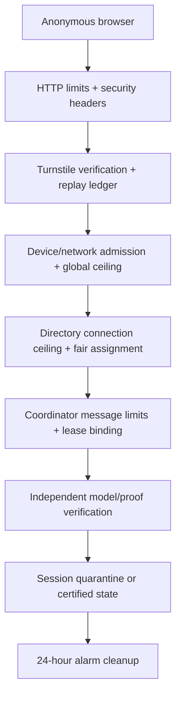

# How launch safety contains abuse and quota pressure

Correct result checking is necessary but not sufficient for a public service.
HiveSAT must also remain predictable when inputs are malformed, clients churn,
tokens are replayed, or configured capacity is nearly full. Launch hardening
puts explicit bounds around every trust boundary and provides operator actions
that preserve correctness.

## Defense in depth



No single layer is expected to identify every malicious client. Instead, each
layer reduces what the next one must handle:

1. Requests and WebSocket messages are rejected before unbounded parsing.
2. A successful Turnstile token is consumed once in the globally serialized
   directory object, preventing replay across device or network identities.
3. HMACed network identity, anonymous device identity, rolling creation limits,
   and the active-job ceiling bound admission.
4. Per-job and directory WebSocket ceilings reject excess connections with a
   retry delay.
5. The coordinator validates protocol version, IDs, assumptions, task depth,
   result manifests, artifact sizes, and lease relationships.
6. Invalid models or proofs quarantine the reporting session. Timeouts remain
   separate because resource exhaustion is not evidence of dishonesty.
7. Only independently checked evidence changes a terminal job state.

## Request and artifact bounds

| Surface | Enforced bound |
| --- | --- |
| Small API JSON | 8 KiB |
| Coordinator control message | 16 KiB |
| Directory control message | 8 KiB |
| Cube assumptions | 64 distinct variables |
| Task tree | 10,000 tasks, depth 64 |
| Formula | 5 MiB gzip, 32 MiB canonical, 2,000,000 literals |
| SAT model | 512 KiB |
| LRAT per job | 25 MiB gzip, 128 MiB expanded |
| Job coordinator sockets | 32 by default |
| Directory handoff sockets | 128 by default |

Malformed values fail with a structured JSON error on HTTP or a bounded error
message followed by WebSocket closure. Parser fuzz tests feed random ASCII,
bytes, object shapes, excessive cubes, malformed manifests, and LRAT text into
the same production validators. Their invariant is not “all random input is
invalid”; it is “validation never escapes its bounds or turns uncertainty into
a result.”

## Token lifecycle

HiveSAT stores digests, never bearer tokens, in Durable Object SQL.

- The formula upload token is erased after its one successful use.
- Lease IDs are 192-bit random, short-lived, and scope model/proof uploads to
  one task.
- A validated Turnstile token digest is inserted into a replay table before
  admission. A second use returns `TURNSTILE_REPLAY` even with a new device ID.
- Owners can rotate their credential. Rotation atomically replaces the digest,
  writes the new token to IndexedDB and the URL fragment, and immediately
  invalidates the old URL.

The public share URL never contains the owner token. Token rotation does not
change job priority or extend expiry.

## Browser and transport policy

Every ordinary response receives a restrictive Content Security Policy and
defense headers. The policy permits same-origin application code, the pinned
WebAssembly runtime, dedicated/blob workers, and Cloudflare Turnstile; it
denies plugins, framing, unrelated forms, camera, microphone, location,
payments, and USB. Production responses add HSTS.

WebSocket clients use capped exponential reconnect backoff with jitter.
`UPGRADE_REQUIRED` is terminal rather than a reconnect loop. Phase 11 advances
the public protocol version, so older clients receive a clear upgrade response
before Turnstile or allocation work.

## Capacity and kill switches

`GET /api/v1/health` exposes a bounded aggregate quota view:

```json
{
  "quota": {
    "state": "NORMAL",
    "limits": {
      "maxActiveJobs": 100,
      "maxJobConnections": 32,
      "maxDirectoryConnections": 128,
      "safetyMarginPercent": 80
    },
    "usage": {
      "activeJobs": 4,
      "activeWorkers": 11,
      "activeAssignments": 6,
      "directoryConnections": 0
    }
  }
}
```

At the configured margin it changes to `NEAR_LIMIT`. Operators can reduce the
active-job ceiling or turn off either admission or public assignment without a
code change. Disabling public jobs prevents creation; disabling the swarm
prevents new directory handoffs. Existing coordinators still expire and clean
up their artifacts normally.

The deterministic load model uses worker-time, duty cycle, 60-second sparse
heartbeats, long leases, one-hour assignment quanta, cache-hit rate, and result
frequency. It explicitly shows that heartbeats do not write SQL rows. Launch
gates compare projections with configurable ceilings at the same safety
margin; they do not claim free-plan capacity is guaranteed.

## Rolling updates and partial deployment

Protocol and schema changes fail closed:

1. Clients include the exact protocol version in every control message.
2. A newer server rejects an older message with `UPGRADE_REQUIRED`.
3. Durable Object classes run ordered internal SQLite migrations inside
   `blockConcurrencyWhile` before handling traffic.
4. Migrations are append-only and idempotent. Object eviction and restart
   preserve lease and verification state.
5. If application assets and Durable Objects briefly disagree during a rolling
   update, the client stops on upgrade error instead of guessing a message
   shape.

Wrangler namespace migrations remain unchanged when only a class's internal
SQLite schema advances. New classes would require a new append-only Wrangler
migration tag.

## Expiry is part of privacy and cost control

Each job has one earliest-deadline alarm. At expiry the coordinator closes
sockets, cancels leases, deletes the canonical formula plus model and proof
objects from Workers KV, tells the directory to remove the job, and deletes its SQL
storage. Directory alarms also expire reservations, replay rows, and rolling
creation history.

Cleanup tests cover Workers KV content and Durable Object state. The operator runbook
adds the production checks for orphaned key prefixes and alarm failures.

## What launch hardening does not promise

HiveSAT remains anonymous public compute:

- submitted formulas are visible to participants;
- device IDs and HMACed network identifiers are abuse controls, not accounts;
- owner-browser UNSAT and server-certified UNSAT remain visibly different;
- browser contribution is explicit and page-scoped;
- free-plan capacity is a target with fail-closed rejection, not an SLA; and
- a malicious participant can waste its lease, but cannot forge a checked
  terminal result.

The concise operational response is in
[the operator runbook](../operator-runbook.md). Data handling and user-facing
limitations are in [privacy and trust](../privacy-and-trust.md).
