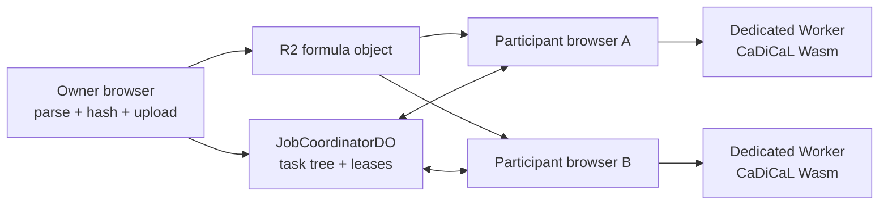

# How HiveSAT works

This guide explains HiveSAT from first principles. It is written for readers
who have never used a SAT solver, WebAssembly, browser workers, or Cloudflare
Durable Objects.

Read the pages in order:

1. [SAT solving from the beginning](01-sat-solving.md)
2. [From a DIMACS file to verified browser memory](02-formula-pipeline.md)
3. [How cube-and-conquer distributes one search](03-distributed-cubes.md)
4. [Why results are not trusted on arrival](04-result-correctness.md)
5. [How the public swarm shares compute fairly](05-fair-swarm-scheduling.md)
6. The Swarm Mode user experience *(Phase 9)*

The shorter reference documents in the parent `docs/` directory specify wire
formats and APIs. This guide tells the story: what problem each component
solves, what happens step by step, and why the safety checks exist.

## The system in one picture

The large formula travels through R2 and normal HTTP streaming. Small control
messages—request work, renew a lease, split, yield, or report a candidate—travel
through one hibernating WebSocket per job. The Cloudflare Worker coordinates
the search; it does not perform the SAT search itself.

Next: [SAT solving from the beginning →](01-sat-solving.md)
